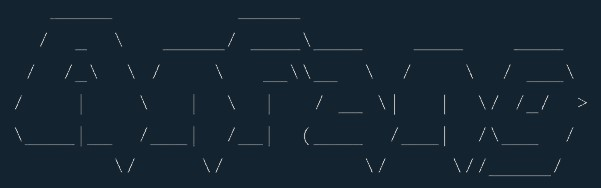

<p align="center">
  
</p>

<a href="#"></a>
<a href="#"></a>

## What is ANFANG?
 A collection of small web-security challenges for beginners to get awareness and train themselves with basics.

## Features
- Create your own challenges, hints, and flags from the Admin Interface
- Leaderboard - Ordering based on timestamps and points

## Coming in the next versions
- Unlockable hints
- OAuth for Email verification during signup
- Pagination for Home page and Leaderboard
- Dynamic Scoring of Challenges

## Install
To be updated.

 ## Team:
 ```ruby
 Paul Babu Kadali
 Binesh Munukurthi
 Abhijeet Mahapatra
 Vikranth Kumar Bala
 ```